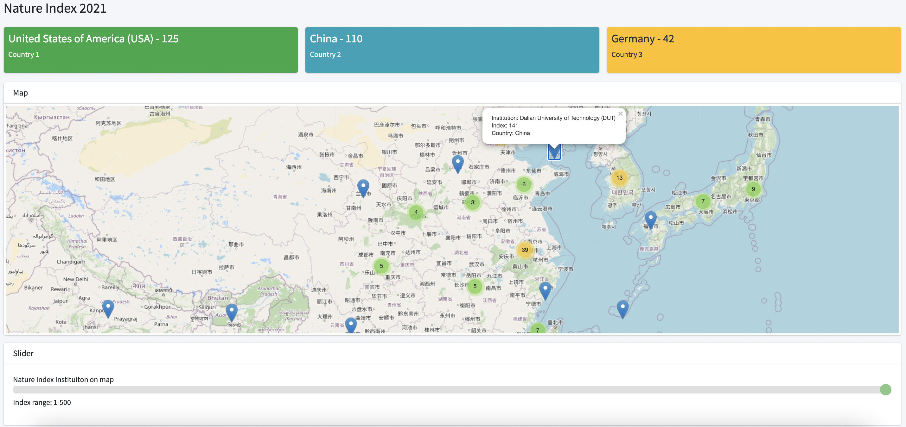

# Nature Index 2021 institutions on the map

The 2021 tables are based on Nature Index data from 1 January 2020 to 31 December 2020. See more [here](https://www.natureindex.com/annual-tables/2021/institution/academic/all). The coordinates of the institute are retrieved by using [Google Geocoding API](https://github.com/googlemaps/google-maps-services-python).

I created this project to show those institutions on the map. Each institution will be associated with a clickable marker, based on its location. The web layout included three info boxes at the top showing top countries with counts, a map at the middle, and a slider to filter the range of the index at the bottom.

